# Kingtavo Database Schema

This document provides a comprehensive reference for the Kingtavo database schema, including all tables, relationships, and field descriptions with a focus on decoration-specific entities.

## Core Tables

### Company (Tenant)

```sql
CREATE TABLE public.company (
  id UUID PRIMARY KEY DEFAULT gen_random_uuid(),
  name TEXT NOT NULL,
  logo_url TEXT,
  primary_color TEXT,
  secondary_color TEXT,
  created_at TIMESTAMPTZ NOT NULL DEFAULT now(),
  updated_at TIMESTAMPTZ NOT NULL DEFAULT now()
);
```

### Users

```sql
CREATE TABLE public.users (
  id UUID PRIMARY KEY REFERENCES auth.users,
  email TEXT NOT NULL UNIQUE,
  first_name TEXT,
  last_name TEXT,
  company_id UUID REFERENCES public.company(id),
  role TEXT NOT NULL DEFAULT 'user',
  created_at TIMESTAMPTZ NOT NULL DEFAULT now(),
  updated_at TIMESTAMPTZ NOT NULL DEFAULT now()
);
```

### Roles

```sql
CREATE TABLE public.roles (
  id UUID PRIMARY KEY DEFAULT gen_random_uuid(),
  name TEXT NOT NULL,
  description TEXT,
  permissions JSONB,
  company_id UUID REFERENCES public.company(id),
  created_at TIMESTAMPTZ NOT NULL DEFAULT now(),
  updated_at TIMESTAMPTZ NOT NULL DEFAULT now()
);
```

### User Roles

```sql
CREATE TABLE public.user_roles (
  id UUID PRIMARY KEY DEFAULT gen_random_uuid(),
  user_id UUID REFERENCES public.users(id),
  role_id UUID REFERENCES public.roles(id),
  created_at TIMESTAMPTZ NOT NULL DEFAULT now(),
  updated_at TIMESTAMPTZ NOT NULL DEFAULT now(),
  UNIQUE(user_id, role_id)
);
```

## Decoration Technique Tables

### Decoration Techniques

```sql
CREATE TABLE public.decoration_techniques (
  id UUID PRIMARY KEY DEFAULT gen_random_uuid(),
  name TEXT NOT NULL,
  description TEXT,
  company_id UUID REFERENCES public.company(id),
  is_active BOOLEAN NOT NULL DEFAULT true,
  created_at TIMESTAMPTZ NOT NULL DEFAULT now(),
  updated_at TIMESTAMPTZ NOT NULL DEFAULT now()
);
```

### Screen Printing

```sql
CREATE TABLE public.screen_printing (
  id UUID PRIMARY KEY DEFAULT gen_random_uuid(),
  decoration_technique_id UUID REFERENCES public.decoration_techniques(id),
  ink_type TEXT NOT NULL, -- plastisol, water-based, discharge, specialty
  mesh_count INTEGER, -- 86, 110, 156, 180, 200, 230, 305
  frame_type TEXT, -- wood, aluminum, roller
  frame_size TEXT, -- dimensions
  colors_count INTEGER NOT NULL DEFAULT 1,
  flash_required BOOLEAN NOT NULL DEFAULT false,
  squeegee_type TEXT,
  squeegee_durometer TEXT,
  special_effects JSONB, -- puff, metallic, glow, etc.
  created_at TIMESTAMPTZ NOT NULL DEFAULT now(),
  updated_at TIMESTAMPTZ NOT NULL DEFAULT now()
);
```

### Embroidery

```sql
CREATE TABLE public.embroidery (
  id UUID PRIMARY KEY DEFAULT gen_random_uuid(),
  decoration_technique_id UUID REFERENCES public.decoration_techniques(id),
  thread_type TEXT NOT NULL, -- polyester, rayon, metallic, wool, cotton
  thread_weight TEXT,
  thread_brand TEXT,
  stitch_count INTEGER,
  stitch_density FLOAT,
  backing_type TEXT, -- cut-away, tear-away, water-soluble
  special_techniques JSONB, -- 3D foam, appliqué, etc.
  created_at TIMESTAMPTZ NOT NULL DEFAULT now(),
  updated_at TIMESTAMPTZ NOT NULL DEFAULT now()
);
```

### DTG (Direct to Garment)

```sql
CREATE TABLE public.dtg (
  id UUID PRIMARY KEY DEFAULT gen_random_uuid(),
  decoration_technique_id UUID REFERENCES public.decoration_techniques(id),
  pretreatment_required BOOLEAN NOT NULL DEFAULT false,
  pretreatment_type TEXT,
  resolution INTEGER, -- 600dpi, 1200dpi
  white_underbase BOOLEAN NOT NULL DEFAULT false,
  color_profile TEXT,
  curing_temperature INTEGER,
  curing_time INTEGER,
  created_at TIMESTAMPTZ NOT NULL DEFAULT now(),
  updated_at TIMESTAMPTZ NOT NULL DEFAULT now()
);
```

### Vinyl/Heat Transfer

```sql
CREATE TABLE public.vinyl (
  id UUID PRIMARY KEY DEFAULT gen_random_uuid(),
  decoration_technique_id UUID REFERENCES public.decoration_techniques(id),
  material_type TEXT NOT NULL, -- standard, glitter, reflective, flock, sublimation
  cutting_equipment TEXT,
  application_temperature INTEGER,
  application_pressure TEXT,
  application_time INTEGER,
  multi_layer BOOLEAN NOT NULL DEFAULT false,
  weeding_complexity TEXT, -- low, medium, high
  created_at TIMESTAMPTZ NOT NULL DEFAULT now(),
  updated_at TIMESTAMPTZ NOT NULL DEFAULT now()
);
```

## Equipment Tables

### Equipment

```sql
CREATE TABLE public.equipment (
  id UUID PRIMARY KEY DEFAULT gen_random_uuid(),
  name TEXT NOT NULL,
  type TEXT NOT NULL, -- press, embroidery machine, dtg printer, heat press, etc.
  model TEXT,
  manufacturer TEXT,
  company_id UUID REFERENCES public.company(id),
  is_active BOOLEAN NOT NULL DEFAULT true,
  created_at TIMESTAMPTZ NOT NULL DEFAULT now(),
  updated_at TIMESTAMPTZ NOT NULL DEFAULT now()
);
```

### Screen Printing Equipment

```sql
CREATE TABLE public.screen_printing_equipment (
  id UUID PRIMARY KEY DEFAULT gen_random_uuid(),
  equipment_id UUID REFERENCES public.equipment(id),
  press_type TEXT NOT NULL, -- manual, automatic
  stations_count INTEGER,
  colors_count INTEGER,
  max_print_area JSONB, -- {width: 16, height: 20, unit: "inches"}
  platen_sizes JSONB[], -- array of available platen sizes
  special_capabilities JSONB, -- oversized, sleeve printing, etc.
  created_at TIMESTAMPTZ NOT NULL DEFAULT now(),
  updated_at TIMESTAMPTZ NOT NULL DEFAULT now()
);
```

### Embroidery Equipment

```sql
CREATE TABLE public.embroidery_equipment (
  id UUID PRIMARY KEY DEFAULT gen_random_uuid(),
  equipment_id UUID REFERENCES public.equipment(id),
  heads_count INTEGER,
  needles_per_head INTEGER,
  max_speed INTEGER, -- stitches per minute
  max_hoop_size JSONB, -- {width: 12, height: 8, unit: "inches"}
  special_attachments JSONB, -- sequin, cording, etc.
  created_at TIMESTAMPTZ NOT NULL DEFAULT now(),
  updated_at TIMESTAMPTZ NOT NULL DEFAULT now()
);
```

### DTG Equipment

```sql
CREATE TABLE public.dtg_equipment (
  id UUID PRIMARY KEY DEFAULT gen_random_uuid(),
  equipment_id UUID REFERENCES public.equipment(id),
  max_print_area JSONB, -- {width: 16, height: 20, unit: "inches"}
  max_resolution INTEGER, -- dpi
  ink_type TEXT,
  pretreatment_capability BOOLEAN NOT NULL DEFAULT false,
  production_speed INTEGER, -- shirts per hour
  created_at TIMESTAMPTZ NOT NULL DEFAULT now(),
  updated_at TIMESTAMPTZ NOT NULL DEFAULT now()
);
```

### Vinyl Equipment

```sql
CREATE TABLE public.vinyl_equipment (
  id UUID PRIMARY KEY DEFAULT gen_random_uuid(),
  equipment_id UUID REFERENCES public.equipment(id),
  equipment_type TEXT NOT NULL, -- cutter, heat press
  max_width INTEGER, -- for cutters
  max_force INTEGER, -- for cutters
  max_size JSONB, -- {width: 16, height: 20, unit: "inches"} for heat press
  temperature_range JSONB, -- {min: 200, max: 400, unit: "F"} for heat press
  pressure_settings JSONB, -- for heat press
  special_capabilities JSONB, -- cap press, mug press, etc.
  created_at TIMESTAMPTZ NOT NULL DEFAULT now(),
  updated_at TIMESTAMPTZ NOT NULL DEFAULT now()
);
```

## Product and Catalog Tables

### Products

```sql
CREATE TABLE public.products (
  id UUID PRIMARY KEY DEFAULT gen_random_uuid(),
  name TEXT NOT NULL,
  description TEXT,
  sku TEXT,
  company_id UUID REFERENCES public.company(id),
  category_id UUID REFERENCES public.categories(id),
  base_price DECIMAL(10, 2) NOT NULL,
  is_active BOOLEAN NOT NULL DEFAULT true,
  created_at TIMESTAMPTZ NOT NULL DEFAULT now(),
  updated_at TIMESTAMPTZ NOT NULL DEFAULT now()
);
```

### Product Variants

```sql
CREATE TABLE public.product_variants (
  id UUID PRIMARY KEY DEFAULT gen_random_uuid(),
  product_id UUID REFERENCES public.products(id),
  size TEXT,
  color TEXT,
  sku TEXT,
  price_adjustment DECIMAL(10, 2) DEFAULT 0,
  inventory_quantity INTEGER DEFAULT 0,
  is_active BOOLEAN NOT NULL DEFAULT true,
  created_at TIMESTAMPTZ NOT NULL DEFAULT now(),
  updated_at TIMESTAMPTZ NOT NULL DEFAULT now()
);
```

### Decoration Placement Options

```sql
CREATE TABLE public.decoration_placements (
  id UUID PRIMARY KEY DEFAULT gen_random_uuid(),
  name TEXT NOT NULL, -- left chest, full front, back, sleeve, etc.
  description TEXT,
  max_size JSONB, -- {width: 4, height: 4, unit: "inches"}
  position_coordinates JSONB, -- {x: 7, y: 9, unit: "inches", reference: "shoulder seam"}
  product_type TEXT, -- t-shirt, hoodie, hat, etc.
  created_at TIMESTAMPTZ NOT NULL DEFAULT now(),
  updated_at TIMESTAMPTZ NOT NULL DEFAULT now()
);
```

### Product Decoration Compatibility

```sql
CREATE TABLE public.product_decoration_compatibility (
  id UUID PRIMARY KEY DEFAULT gen_random_uuid(),
  product_id UUID REFERENCES public.products(id),
  decoration_technique_id UUID REFERENCES public.decoration_techniques(id),
  placement_id UUID REFERENCES public.decoration_placements(id),
  is_compatible BOOLEAN NOT NULL DEFAULT true,
  notes TEXT,
  created_at TIMESTAMPTZ NOT NULL DEFAULT now(),
  updated_at TIMESTAMPTZ NOT NULL DEFAULT now(),
  UNIQUE(product_id, decoration_technique_id, placement_id)
);
```

### Pricing Rules

```sql
CREATE TABLE public.pricing_rules (
  id UUID PRIMARY KEY DEFAULT gen_random_uuid(),
  company_id UUID REFERENCES public.company(id),
  name TEXT NOT NULL,
  decoration_technique_id UUID REFERENCES public.decoration_techniques(id),
  min_quantity INTEGER NOT NULL,
  max_quantity INTEGER,
  price_type TEXT NOT NULL, -- fixed, percentage
  price_value DECIMAL(10, 2) NOT NULL,
  is_active BOOLEAN NOT NULL DEFAULT true,
  created_at TIMESTAMPTZ NOT NULL DEFAULT now(),
  updated_at TIMESTAMPTZ NOT NULL DEFAULT now()
);
```

### Decoration Upcharges

```sql
CREATE TABLE public.decoration_upcharges (
  id UUID PRIMARY KEY DEFAULT gen_random_uuid(),
  company_id UUID REFERENCES public.company(id),
  decoration_technique_id UUID REFERENCES public.decoration_techniques(id),
  name TEXT NOT NULL, -- oversized, specialty ink, metallic thread, etc.
  description TEXT,
  price_type TEXT NOT NULL, -- fixed, percentage
  price_value DECIMAL(10, 2) NOT NULL,
  is_active BOOLEAN NOT NULL DEFAULT true,
  created_at TIMESTAMPTZ NOT NULL DEFAULT now(),
  updated_at TIMESTAMPTZ NOT NULL DEFAULT now()
);
```

## Order and Quote Tables

### Customers

```sql
CREATE TABLE public.customers (
  id UUID PRIMARY KEY DEFAULT gen_random_uuid(),
  company_id UUID REFERENCES public.company(id),
  name TEXT NOT NULL,
  email TEXT,
  phone TEXT,
  address JSONB,
  notes TEXT,
  created_at TIMESTAMPTZ NOT NULL DEFAULT now(),
  updated_at TIMESTAMPTZ NOT NULL DEFAULT now()
);
```

### Quotes

```sql
CREATE TABLE public.quotes (
  id UUID PRIMARY KEY DEFAULT gen_random_uuid(),
  company_id UUID REFERENCES public.company(id),
  customer_id UUID REFERENCES public.customers(id),
  status TEXT NOT NULL DEFAULT 'draft', -- draft, sent, approved, rejected, expired
  expiration_date TIMESTAMPTZ,
  total_amount DECIMAL(10, 2),
  notes TEXT,
  created_at TIMESTAMPTZ NOT NULL DEFAULT now(),
  updated_at TIMESTAMPTZ NOT NULL DEFAULT now()
);
```

### Quote Items

```sql
CREATE TABLE public.quote_items (
  id UUID PRIMARY KEY DEFAULT gen_random_uuid(),
  quote_id UUID REFERENCES public.quotes(id),
  product_id UUID REFERENCES public.products(id),
  product_variant_id UUID REFERENCES public.product_variants(id),
  decoration_technique_id UUID REFERENCES public.decoration_techniques(id),
  placement_id UUID REFERENCES public.decoration_placements(id),
  quantity INTEGER NOT NULL,
  unit_price DECIMAL(10, 2) NOT NULL,
  decoration_details JSONB, -- technique-specific details
  created_at TIMESTAMPTZ NOT NULL DEFAULT now(),
  updated_at TIMESTAMPTZ NOT NULL DEFAULT now()
);
```

### Orders

```sql
CREATE TABLE public.orders (
  id UUID PRIMARY KEY DEFAULT gen_random_uuid(),
  company_id UUID REFERENCES public.company(id),
  customer_id UUID REFERENCES public.customers(id),
  quote_id UUID REFERENCES public.quotes(id),
  status TEXT NOT NULL DEFAULT 'new', -- new, in production, completed, shipped, etc.
  due_date TIMESTAMPTZ,
  total_amount DECIMAL(10, 2),
  payment_status TEXT NOT NULL DEFAULT 'unpaid', -- unpaid, partial, paid
  notes TEXT,
  created_at TIMESTAMPTZ NOT NULL DEFAULT now(),
  updated_at TIMESTAMPTZ NOT NULL DEFAULT now()
);
```

### Order Items

```sql
CREATE TABLE public.order_items (
  id UUID PRIMARY KEY DEFAULT gen_random_uuid(),
  order_id UUID REFERENCES public.orders(id),
  product_id UUID REFERENCES public.products(id),
  product_variant_id UUID REFERENCES public.product_variants(id),
  decoration_technique_id UUID REFERENCES public.decoration_techniques(id),
  placement_id UUID REFERENCES public.decoration_placements(id),
  quantity INTEGER NOT NULL,
  unit_price DECIMAL(10, 2) NOT NULL,
  decoration_details JSONB, -- technique-specific details
  status TEXT NOT NULL DEFAULT 'pending', -- pending, in production, completed
  created_at TIMESTAMPTZ NOT NULL DEFAULT now(),
  updated_at TIMESTAMPTZ NOT NULL DEFAULT now()
);
```

## Artwork and File Management

### Artwork Files

```sql
CREATE TABLE public.artwork_files (
  id UUID PRIMARY KEY DEFAULT gen_random_uuid(),
  company_id UUID REFERENCES public.company(id),
  customer_id UUID REFERENCES public.customers(id),
  name TEXT NOT NULL,
  file_url TEXT NOT NULL,
  file_type TEXT NOT NULL, -- ai, eps, svg, png, jpg, dst, etc.
  thumbnail_url TEXT,
  metadata JSONB, -- colors, dimensions, etc.
  created_at TIMESTAMPTZ NOT NULL DEFAULT now(),
  updated_at TIMESTAMPTZ NOT NULL DEFAULT now()
);
```

### Artwork Versions

```sql
CREATE TABLE public.artwork_versions (
  id UUID PRIMARY KEY DEFAULT gen_random_uuid(),
  artwork_id UUID REFERENCES public.artwork_files(id),
  version_number INTEGER NOT NULL,
  file_url TEXT NOT NULL,
  thumbnail_url TEXT,
  changes_description TEXT,
  created_by UUID REFERENCES public.users(id),
  created_at TIMESTAMPTZ NOT NULL DEFAULT now()
);
```

### Artwork Approvals

```sql
CREATE TABLE public.artwork_approvals (
  id UUID PRIMARY KEY DEFAULT gen_random_uuid(),
  artwork_id UUID REFERENCES public.artwork_files(id),
  version_id UUID REFERENCES public.artwork_versions(id),
  order_id UUID REFERENCES public.orders(id),
  status TEXT NOT NULL DEFAULT 'pending', -- pending, approved, rejected
  approved_by UUID REFERENCES public.users(id),
  approval_date TIMESTAMPTZ,
  comments TEXT,
  created_at TIMESTAMPTZ NOT NULL DEFAULT now(),
  updated_at TIMESTAMPTZ NOT NULL DEFAULT now()
);
```

### Production Files

```sql
CREATE TABLE public.production_files (
  id UUID PRIMARY KEY DEFAULT gen_random_uuid(),
  artwork_id UUID REFERENCES public.artwork_files(id),
  file_type TEXT NOT NULL, -- separations, dst, cut file, etc.
  file_url TEXT NOT NULL,
  decoration_technique_id UUID REFERENCES public.decoration_techniques(id),
  production_notes TEXT,
  created_by UUID REFERENCES public.users(id),
  created_at TIMESTAMPTZ NOT NULL DEFAULT now(),
  updated_at TIMESTAMPTZ NOT NULL DEFAULT now()
);
```

## Production Management

### Tasks

```sql
CREATE TABLE public.tasks (
  id UUID PRIMARY KEY DEFAULT gen_random_uuid(),
  company_id UUID REFERENCES public.company(id),
  order_id UUID REFERENCES public.orders(id),
  order_item_id UUID REFERENCES public.order_items(id),
  title TEXT NOT NULL,
  description TEXT,
  task_type TEXT NOT NULL, -- art approval, screen prep, printing, etc.
  status TEXT NOT NULL DEFAULT 'pending', -- pending, in progress, completed, etc.
  assigned_to UUID REFERENCES public.users(id),
  due_date TIMESTAMPTZ,
  priority TEXT DEFAULT 'medium', -- low, medium, high, urgent
  equipment_id UUID REFERENCES public.equipment(id),
  created_at TIMESTAMPTZ NOT NULL DEFAULT now(),
  updated_at TIMESTAMPTZ NOT NULL DEFAULT now(),
  completed_at TIMESTAMPTZ
);
```

### Task History

```sql
CREATE TABLE public.task_history (
  id UUID PRIMARY KEY DEFAULT gen_random_uuid(),
  task_id UUID REFERENCES public.tasks(id),
  status TEXT NOT NULL,
  notes TEXT,
  created_by UUID REFERENCES public.users(id),
  created_at TIMESTAMPTZ NOT NULL DEFAULT now()
);
```

### Production Specifications

```sql
CREATE TABLE public.production_specifications (
  id UUID PRIMARY KEY DEFAULT gen_random_uuid(),
  order_item_id UUID REFERENCES public.order_items(id),
  decoration_technique_id UUID REFERENCES public.decoration_techniques(id),
  specifications JSONB, -- technique-specific production details
  special_instructions TEXT,
  created_at TIMESTAMPTZ NOT NULL DEFAULT now(),
  updated_at TIMESTAMPTZ NOT NULL DEFAULT now()
);
```

### Quality Control

```sql
CREATE TABLE public.quality_control (
  id UUID PRIMARY KEY DEFAULT gen_random_uuid(),
  order_item_id UUID REFERENCES public.order_items(id),
  inspector_id UUID REFERENCES public.users(id),
  status TEXT NOT NULL DEFAULT 'pending', -- pending, passed, failed
  inspection_date TIMESTAMPTZ,
  issues JSONB,
  notes TEXT,
  created_at TIMESTAMPTZ NOT NULL DEFAULT now(),
  updated_at TIMESTAMPTZ NOT NULL DEFAULT now()
);
```

## Inventory Management

### Inventory Items

```sql
CREATE TABLE public.inventory_items (
  id UUID PRIMARY KEY DEFAULT gen_random_uuid(),
  company_id UUID REFERENCES public.company(id),
  name TEXT NOT NULL,
  type TEXT NOT NULL, -- blank goods, ink, thread, vinyl, etc.
  sku TEXT,
  quantity INTEGER NOT NULL DEFAULT 0,
  reorder_threshold INTEGER,
  unit_cost DECIMAL(10, 2),
  location TEXT,
  created_at TIMESTAMPTZ NOT NULL DEFAULT now(),
  updated_at TIMESTAMPTZ NOT NULL DEFAULT now()
);
```

### Inventory Transactions

```sql
CREATE TABLE public.inventory_transactions (
  id UUID PRIMARY KEY DEFAULT gen_random_uuid(),
  inventory_item_id UUID REFERENCES public.inventory_items(id),
  transaction_type TEXT NOT NULL, -- purchase, usage, adjustment
  quantity INTEGER NOT NULL,
  order_id UUID REFERENCES public.orders(id),
  task_id UUID REFERENCES public.tasks(id),
  notes TEXT,
  created_by UUID REFERENCES public.users(id),
  created_at TIMESTAMPTZ NOT NULL DEFAULT now()
);
```

### Consumables Tracking

```sql
CREATE TABLE public.consumables_tracking (
  id UUID PRIMARY KEY DEFAULT gen_random_uuid(),
  order_item_id UUID REFERENCES public.order_items(id),
  inventory_item_id UUID REFERENCES public.inventory_items(id),
  quantity_used DECIMAL(10, 2) NOT NULL,
  unit_cost DECIMAL(10, 2),
  notes TEXT,
  created_at TIMESTAMPTZ NOT NULL DEFAULT now(),
  updated_at TIMESTAMPTZ NOT NULL DEFAULT now()
);
```

## Row Level Security Policies

```sql
-- Enable RLS for all tables
ALTER TABLE public.company ENABLE ROW LEVEL SECURITY;
ALTER TABLE public.users ENABLE ROW LEVEL SECURITY;
-- Enable RLS for all other tables

-- Helper function to get the company_id for the currently authenticated user
CREATE OR REPLACE FUNCTION get_my_company_id()
RETURNS UUID AS $$
DECLARE
  company_uuid UUID;
BEGIN
  SELECT company_id INTO company_uuid FROM public.users WHERE id = auth.uid();
  RETURN company_uuid;
END;
$$ LANGUAGE plpgsql SECURITY DEFINER;

-- Example RLS policies for company table
CREATE POLICY "Users can view their own company" ON public.company
  FOR SELECT USING (id = get_my_company_id());

CREATE POLICY "Only admins can update company" ON public.company
  FOR UPDATE USING (
    id = get_my_company_id() AND 
    EXISTS (
      SELECT 1 FROM public.users 
      WHERE id = auth.uid() AND role = 'admin'
    )
  );

-- Example RLS policies for users table
CREATE POLICY "Users can view users in their company" ON public.users
  FOR SELECT USING (company_id = get_my_company_id());

CREATE POLICY "Only admins can create users" ON public.users
  FOR INSERT WITH CHECK (
    company_id = get_my_company_id() AND
    EXISTS (
      SELECT 1 FROM public.users 
      WHERE id = auth.uid() AND role = 'admin'
    )
  );

-- Similar policies would be created for all tables
```

## Entity Relationship Diagram

```mermaid
erDiagram
    COMPANY ||--o{ USERS : has
    COMPANY ||--o{ ROLES : has
    USERS ||--o{ USER_ROLES : has
    ROLES ||--o{ USER_ROLES : has
    COMPANY ||--o{ DECORATION_TECHNIQUES : has
    DECORATION_TECHNIQUES ||--o{ SCREEN_PRINTING : implements
    DECORATION_TECHNIQUES ||--o{ EMBROIDERY : implements
    DECORATION_TECHNIQUES ||--o{ DTG : implements
    DECORATION_TECHNIQUES ||--o{ VINYL : implements
    COMPANY ||--o{ EQUIPMENT : has
    EQUIPMENT ||--o{ SCREEN_PRINTING_EQUIPMENT : specializes
    EQUIPMENT ||--o{ EMBROIDERY_EQUIPMENT : specializes
    EQUIPMENT ||--o{ DTG_EQUIPMENT : specializes
    EQUIPMENT ||--o{ VINYL_EQUIPMENT : specializes
    COMPANY ||--o{ PRODUCTS : has
    PRODUCTS ||--o{ PRODUCT_VARIANTS : has
    PRODUCTS ||--o{ PRODUCT_DECORATION_COMPATIBILITY : supports
    DECORATION_TECHNIQUES ||--o{ PRODUCT_DECORATION_COMPATIBILITY : applies_to
    DECORATION_PLACEMENTS ||--o{ PRODUCT_DECORATION_COMPATIBILITY : positions
    COMPANY ||--o{ PRICING_RULES : has
    DECORATION_TECHNIQUES ||--o{ PRICING_RULES : affects
    COMPANY ||--o{ DECORATION_UPCHARGES : has
    DECORATION_TECHNIQUES ||--o{ DECORATION_UPCHARGES : applies_to
    COMPANY ||--o{ CUSTOMERS : has
    COMPANY ||--o{ QUOTES : has
    CUSTOMERS ||--o{ QUOTES : requests
    QUOTES ||--o{ QUOTE_ITEMS : contains
    PRODUCTS ||--o{ QUOTE_ITEMS : includes
    PRODUCT_VARIANTS ||--o{ QUOTE_ITEMS : specifies
    DECORATION_TECHNIQUES ||--o{ QUOTE_ITEMS : uses
    DECORATION_PLACEMENTS ||--o{ QUOTE_ITEMS : positions
    COMPANY ||--o{ ORDERS : has
    CUSTOMERS ||--o{ ORDERS : places
    QUOTES ||--o{ ORDERS : converts_to
    ORDERS ||--o{ ORDER_ITEMS : contains
    PRODUCTS ||--o{ ORDER_ITEMS : includes
    PRODUCT_VARIANTS ||--o{ ORDER_ITEMS : specifies
    DECORATION_TECHNIQUES ||--o{ ORDER_ITEMS : uses
    DECORATION_PLACEMENTS ||--o{ ORDER_ITEMS : positions
    COMPANY ||--o{ ARTWORK_FILES : owns
    CUSTOMERS ||--o{ ARTWORK_FILES : provides
    ARTWORK_FILES ||--o{ ARTWORK_VERSIONS : has
    USERS ||--o{ ARTWORK_VERSIONS : creates
    ARTWORK_FILES ||--o{ ARTWORK_APPROVALS : requires
    ARTWORK_VERSIONS ||--o{ ARTWORK_APPROVALS : approves
    ORDERS ||--o{ ARTWORK_APPROVALS : for
    USERS ||--o{ ARTWORK_APPROVALS : approves
    ARTWORK_FILES ||--o{ PRODUCTION_FILES : generates
    DECORATION_TECHNIQUES ||--o{ PRODUCTION_FILES : requires
    USERS ||--o{ PRODUCTION_FILES : creates
    COMPANY ||--o{ TASKS : manages
    ORDERS ||--o{ TASKS : requires
    ORDER_ITEMS ||--o{ TASKS : processes
    USERS ||--o{ TASKS : assigned_to
    EQUIPMENT ||--o{ TASKS : uses
    TASKS ||--o{ TASK_HISTORY : tracks
    USERS ||--o{ TASK_HISTORY : updates
    ORDER_ITEMS ||--o{ PRODUCTION_SPECIFICATIONS : details
    DECORATION_TECHNIQUES ||--o{ PRODUCTION_SPECIFICATIONS : follows
    ORDER_ITEMS ||--o{ QUALITY_CONTROL : verifies
    USERS ||--o{ QUALITY_CONTROL : inspects
    COMPANY ||--o{ INVENTORY_ITEMS : stocks
    INVENTORY_ITEMS ||--o{ INVENTORY_TRANSACTIONS : tracks
    ORDERS ||--o{ INVENTORY_TRANSACTIONS : consumes
    TASKS ||--o{ INVENTORY_TRANSACTIONS : uses
    USERS ||--o{ INVENTORY_TRANSACTIONS : records
    ORDER_ITEMS ||--o{ CONSUMABLES_TRACKING : uses
    INVENTORY_ITEMS ||--o{ CONSUMABLES_TRACKING : depletes
```



This schema provides a comprehensive foundation for the Kingtavo platform, with special attention to the unique requirements of screen printing, embroidery, DTG, and vinyl decoration techniques. The schema supports multi-tenancy, role-based access control, and detailed tracking of decoration-specific parameters throughout the order and production process.
