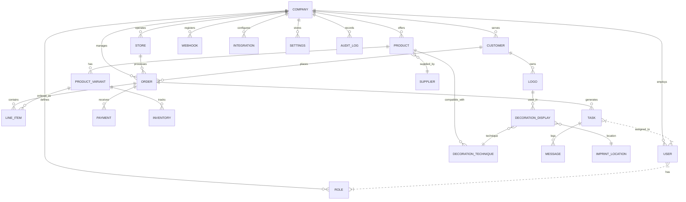

# Database Schema, Migrations, & ERD

This document details the unified Kingtavo database schema, migration strategy, example migration scripts, and the Entity-Relationship Diagram (ERD).

---

## 1. Entity-Relationship Diagram (ERD)

This ERD illustrates the core entities and their relationships within the Kingtavo multi-tenant system.



---

## 2. Schema & Migration Scripts

**Directory:** `/supabase/migrations/`

SQL migration scripts define the table structures, relationships, indexes, and row-level security policies.

### 2.1 Core Tenant & User Tables

```sql
-- Companies (Tenants)
CREATE TABLE public.company (
  id UUID PRIMARY KEY DEFAULT gen_random_uuid(),
  name TEXT NOT NULL UNIQUE, -- Added UNIQUE constraint for clarity
  printavo_account_id TEXT UNIQUE, -- For mapping to external system
  default_currency TEXT NOT NULL DEFAULT 'USD',
  settings JSONB,
  created_at TIMESTAMPTZ NOT NULL DEFAULT now(),
  updated_at TIMESTAMPTZ NOT NULL DEFAULT now()
);
COMMENT ON TABLE public.company IS 'Represents a tenant in the multi-tenant system.';

-- Users
CREATE TABLE public.users (
  id UUID PRIMARY KEY DEFAULT gen_random_uuid(), -- Corresponds to auth.users.id
  company_id UUID NOT NULL REFERENCES public.company(id) ON DELETE CASCADE,
  email TEXT UNIQUE NOT NULL, -- Should match auth.users.email
  -- Removed role from here, using a separate user_roles table
  first_name TEXT,
  last_name TEXT,
  created_at TIMESTAMPTZ NOT NULL DEFAULT now(),
  updated_at TIMESTAMPTZ NOT NULL DEFAULT now()
);
COMMENT ON TABLE public.users IS 'Stores application-specific user profile data linked to a company.';

-- Roles
CREATE TABLE public.role (
    id SERIAL PRIMARY KEY,
    company_id UUID NOT NULL REFERENCES public.company(id) ON DELETE CASCADE,
    name TEXT NOT NULL,
    permissions JSONB, -- Store specific permissions
    created_at TIMESTAMPTZ NOT NULL DEFAULT now(),
    updated_at TIMESTAMPTZ NOT NULL DEFAULT now(),
    UNIQUE (company_id, name)
);
COMMENT ON TABLE public.role IS 'Defines roles within a specific company.';

-- User Roles Junction Table
CREATE TABLE public.user_role (
    user_id UUID NOT NULL REFERENCES public.users(id) ON DELETE CASCADE,
    role_id INTEGER NOT NULL REFERENCES public.role(id) ON DELETE CASCADE,
    PRIMARY KEY (user_id, role_id)
);
COMMENT ON TABLE public.user_role IS 'Assigns roles to users within their company.';

-- Stores
CREATE TABLE public.store (
  id UUID PRIMARY KEY DEFAULT gen_random_uuid(),
  company_id UUID NOT NULL REFERENCES public.company(id) ON DELETE CASCADE,
  name TEXT NOT NULL,
  url TEXT UNIQUE, -- Storefront URL, might be null if internal only
  status TEXT NOT NULL DEFAULT 'active' CHECK (status IN ('active', 'inactive', 'maintenance')),
  settings JSONB,
  created_at TIMESTAMPTZ NOT NULL DEFAULT now(),
  updated_at TIMESTAMPTZ NOT NULL DEFAULT now()
);
COMMENT ON TABLE public.store IS 'Represents individual storefronts or sales channels owned by a company.';

```

### 2.2 Product & Inventory Tables

```sql
-- Products
CREATE TABLE public.products (
  id UUID PRIMARY KEY DEFAULT gen_random_uuid(),
  company_id UUID NOT NULL REFERENCES public.company(id) ON DELETE CASCADE,
  supplier_id UUID REFERENCES public.supplier(id), -- Optional link to supplier
  name TEXT NOT NULL,
  description TEXT,
  base_price NUMERIC(10, 2) NOT NULL DEFAULT 0.00,
  sku_prefix TEXT,
  tags TEXT[],
  created_at TIMESTAMPTZ NOT NULL DEFAULT now(),
  updated_at TIMESTAMPTZ NOT NULL DEFAULT now()
);
COMMENT ON TABLE public.products IS 'Core product information owned by a company.';

-- Product Variants
CREATE TABLE public.product_variants (
  id UUID PRIMARY KEY DEFAULT gen_random_uuid(),
  product_id UUID NOT NULL REFERENCES public.products(id) ON DELETE CASCADE,
  sku TEXT UNIQUE NOT NULL,
  attributes JSONB, -- e.g., {"color": "Blue", "size": "L"}
  additional_price NUMERIC(10, 2) NOT NULL DEFAULT 0.00, -- Price difference from base product
  created_at TIMESTAMPTZ NOT NULL DEFAULT now(),
  updated_at TIMESTAMPTZ NOT NULL DEFAULT now()
);
COMMENT ON TABLE public.product_variants IS 'Specific variations of a product (e.g., size, color). SKU must be unique.';

-- Inventory
CREATE TABLE public.inventory (
  id UUID PRIMARY KEY DEFAULT gen_random_uuid(),
  product_variant_id UUID UNIQUE NOT NULL REFERENCES public.product_variants(id) ON DELETE CASCADE, -- One inventory record per variant
  quantity INTEGER NOT NULL DEFAULT 0,
  location TEXT, -- Optional location tracking
  last_updated TIMESTAMPTZ NOT NULL DEFAULT now()
);
COMMENT ON TABLE public.inventory IS 'Tracks stock levels for each product variant.';

-- Suppliers (Example Reference Table)
CREATE TABLE public.supplier (
    id UUID PRIMARY KEY DEFAULT gen_random_uuid(),
    company_id UUID NOT NULL REFERENCES public.company(id) ON DELETE CASCADE,
    name TEXT NOT NULL,
    contact_info JSONB,
    created_at TIMESTAMPTZ NOT NULL DEFAULT now(),
    updated_at TIMESTAMPTZ NOT NULL DEFAULT now()
);
COMMENT ON TABLE public.supplier IS 'Information about product suppliers.';
```

### 2.3 Order & Task Tables

```sql
-- Customers
CREATE TABLE public.customer (
    id UUID PRIMARY KEY DEFAULT gen_random_uuid(),
    company_id UUID NOT NULL REFERENCES public.company(id) ON DELETE CASCADE,
    name TEXT NOT NULL,
    email TEXT UNIQUE,
    phone TEXT,
    address JSONB,
    created_at TIMESTAMPTZ NOT NULL DEFAULT now(),
    updated_at TIMESTAMPTZ NOT NULL DEFAULT now()
);
COMMENT ON TABLE public.customer IS 'Customer accounts associated with a company.';

-- Orders
CREATE TABLE public.order (
  id UUID PRIMARY KEY DEFAULT gen_random_uuid(),
  company_id UUID NOT NULL REFERENCES public.company(id),
  store_id UUID REFERENCES public.store(id), -- Optional: link to specific store
  customer_id UUID NOT NULL REFERENCES public.customer(id),
  order_number TEXT UNIQUE NOT NULL, -- Human-readable unique order identifier
  status TEXT NOT NULL, -- e.g., 'pending', 'processing', 'shipped', 'completed', 'cancelled'
  order_date TIMESTAMPTZ NOT NULL DEFAULT now(),
  due_date TIMESTAMPTZ,
  total NUMERIC(12,2) NOT NULL,
  shipping_address JSONB,
  billing_address JSONB,
  notes TEXT,
  created_at TIMESTAMPTZ NOT NULL DEFAULT now(),
  updated_at TIMESTAMPTZ NOT NULL DEFAULT now()
);
COMMENT ON TABLE public.order IS 'Represents customer orders placed within a company or store.';

-- Line Items
CREATE TABLE public.line_item (
  id UUID PRIMARY KEY DEFAULT gen_random_uuid(),
  order_id UUID NOT NULL REFERENCES public.order(id) ON DELETE CASCADE,
  product_variant_id UUID NOT NULL REFERENCES public.product_variants(id),
  quantity INT NOT NULL CHECK (quantity > 0),
  unit_price NUMERIC(12,2) NOT NULL, -- Price at the time of order
  total NUMERIC(12,2) NOT NULL, -- quantity * unit_price
  -- Add fields for decoration details if applicable per line item
  decoration_details JSONB,
  created_at TIMESTAMPTZ NOT NULL DEFAULT now(),
  updated_at TIMESTAMPTZ NOT NULL DEFAULT now()
);
COMMENT ON TABLE public.line_item IS 'Individual items included in an order.';

-- Tasks
CREATE TABLE public.task (
  id UUID PRIMARY KEY DEFAULT gen_random_uuid(),
  company_id UUID NOT NULL REFERENCES public.company(id) ON DELETE CASCADE,
  order_id UUID REFERENCES public.order(id), -- Can be linked to an order or standalone
  assigned_to_user_id UUID REFERENCES public.users(id),
  type TEXT NOT NULL, -- e.g., 'Artwork Approval', 'Screen Printing', 'Shipping'
  status TEXT NOT NULL, -- e.g., 'pending', 'in_progress', 'completed', 'blocked'
  priority INTEGER DEFAULT 3, -- Lower number means higher priority
  due_at TIMESTAMPTZ,
  completed_at TIMESTAMPTZ,
  details TEXT,
  created_at TIMESTAMPTZ NOT NULL DEFAULT now(),
  updated_at TIMESTAMPTZ NOT NULL DEFAULT now()
);
COMMENT ON TABLE public.task IS 'Represents work items, often related to fulfilling orders.';

-- Messages (for Task communication)
CREATE TABLE public.message (
  id UUID PRIMARY KEY DEFAULT gen_random_uuid(),
  task_id UUID NOT NULL REFERENCES public.task(id) ON DELETE CASCADE,
  user_id UUID NOT NULL REFERENCES public.users(id),
  content TEXT,
  created_at TIMESTAMPTZ NOT NULL DEFAULT now()
);
COMMENT ON TABLE public.message IS 'Communication log associated with specific tasks.';

```

### 2.4 Indexes & Performance

```sql
-- Indexes on foreign keys for join performance
CREATE INDEX idx_users_company_id ON public.users (company_id);
CREATE INDEX idx_role_company_id ON public.role (company_id);
CREATE INDEX idx_user_role_role_id ON public.user_role (role_id);
CREATE INDEX idx_store_company_id ON public.store (company_id);
CREATE INDEX idx_products_company_id ON public.products (company_id);
CREATE INDEX idx_products_supplier_id ON public.products (supplier_id);
CREATE INDEX idx_variants_product_id ON public.product_variants (product_id);
CREATE INDEX idx_inventory_variant_id ON public.inventory (product_variant_id);
CREATE INDEX idx_supplier_company_id ON public.supplier (company_id);
CREATE INDEX idx_customer_company_id ON public.customer (company_id);
CREATE INDEX idx_order_company_id ON public.order (company_id);
CREATE INDEX idx_order_store_id ON public.order (store_id);
CREATE INDEX idx_order_customer_id ON public.order (customer_id);
CREATE INDEX idx_line_item_order_id ON public.line_item (order_id);
CREATE INDEX idx_line_item_variant_id ON public.line_item (product_variant_id);
CREATE INDEX idx_task_company_id ON public.task (company_id);
CREATE INDEX idx_task_order_id ON public.task (order_id);
CREATE INDEX idx_task_assigned_to ON public.task (assigned_to_user_id);
CREATE INDEX idx_message_task_id ON public.message (task_id);
CREATE INDEX idx_message_user_id ON public.message (user_id);

-- Indexes on frequently filtered/sorted columns
CREATE INDEX idx_products_name ON public.products USING gin (name gin_trgm_ops); -- For fuzzy text search
CREATE INDEX idx_variants_sku ON public.product_variants (sku);
CREATE INDEX idx_order_status ON public.order (status);
CREATE INDEX idx_order_order_date ON public.order (order_date DESC);
CREATE INDEX idx_task_status ON public.task (status);
CREATE INDEX idx_task_priority_due ON public.task (priority ASC, due_at ASC);
```

### 2.5 Row-Level Security (RLS) Policies

RLS is crucial for multi-tenancy. Policies ensure users can only access data belonging to their assigned company.

```sql
-- Enable RLS for all relevant tables
ALTER TABLE public.company ENABLE ROW LEVEL SECURITY;
ALTER TABLE public.users ENABLE ROW LEVEL SECURITY;
ALTER TABLE public.role ENABLE ROW LEVEL SECURITY;
ALTER TABLE public.user_role ENABLE ROW LEVEL SECURITY;
ALTER TABLE public.store ENABLE ROW LEVEL SECURITY;
ALTER TABLE public.products ENABLE ROW LEVEL SECURITY;
-- ... enable RLS for all other tables ...

-- Helper function to get the company_id for the currently authenticated user
CREATE OR REPLACE FUNCTION get_my_company_id()
RETURNS UUID AS $$
DECLARE
  company_uuid UUID;
BEGIN
  SELECT company_id INTO company_uuid FROM public.users WHERE id = auth.uid();
  RETURN company_uuid;
END;
$$ LANGUAGE plpgsql SECURITY DEFINER;

-- Generic RLS Policy for tables with a direct company_id column
CREATE POLICY select_own_company_data ON public.products FOR SELECT
USING (company_id = get_my_company_id());

CREATE POLICY insert_own_company_data ON public.products FOR INSERT
WITH CHECK (company_id = get_my_company_id());

CREATE POLICY update_own_company_data ON public.products FOR UPDATE
USING (company_id = get_my_company_id());

CREATE POLICY delete_own_company_data ON public.products FOR DELETE
USING (company_id = get_my_company_id());

-- Apply similar policies to other tables like store, customer, order, task, etc.

-- RLS Policy for the users table (Users can see others in their own company)
CREATE POLICY select_users_in_own_company ON public.users FOR SELECT
USING (company_id = get_my_company_id());

-- RLS Policy for user_role (Ensure linking within the same company)
CREATE POLICY manage_user_roles_in_own_company ON public.user_role FOR ALL
USING (
  EXISTS (
    SELECT 1 FROM public.users u WHERE u.id = user_role.user_id AND u.company_id = get_my_company_id()
  )
  AND
  EXISTS (
    SELECT 1 FROM public.role r WHERE r.id = user_role.role_id AND r.company_id = get_my_company_id()
  )
);

-- Add specific policies based on roles if needed
-- Example: Admins can manage all data within their company
-- CREATE POLICY admin_all_access ON public.products FOR ALL
-- USING (company_id = get_my_company_id() AND check_user_role('admin'));
-- (Requires a check_user_role function)
```

---

## 3. Migration Strategy & Guidelines

### 3.1 Strategy

- **Tooling:** Use Supabase CLI (`supabase db push`, `supabase migration new <name>`) for managing database migrations.
- **Versioning:** Maintain versioned SQL migration files under `/supabase/migrations/`. Each file represents an atomic change.
- **Environment Consistency:** Apply migrations through CI/CD pipelines (e.g., GitHub Actions) to maintain consistency across development, staging, and production environments.
- **Backward Compatibility:** Implement migrations in incremental steps, striving for backward compatibility where possible, especially during application updates.
- **Seeding:** Include seed scripts (e.g., using `psql`, Node.js/Prisma, or Supabase seed.sql) for initial data population (reference data, default roles, test accounts).

### 3.2 Guidelines

1.  **Sequence of Execution (Example):**
    *   Static/reference data (e.g., default roles, decoration techniques)
    *   Companies (Tenants)
    *   Users & Roles
    *   Suppliers
    *   Products & Variants
    *   Customers
    *   Orders & Line Items
    *   Tasks
    *   Payments, Invoices, etc.

2.  **Validation & Integrity Checks:**
    *   Utilize database constraints (FOREIGN KEY, UNIQUE, CHECK) to enforce data integrity.
    *   Ensure cascade rules (`ON DELETE CASCADE`) are used appropriately for related data cleanup.
    *   Add validation logic within application services where database constraints are insufficient.

3.  **Tools & Automation:**
    *   Supabase CLI (`supabase db push`, `supabase migration`) is the primary tool.
    *   Consider helper scripts for complex data seeding or backfills.
    *   Integrate migration steps into CI/CD pipelines (e.g., run `supabase db push` in a deployment script).

4.  **Change Tracking & Audit:**
    *   Include `created_at` and `updated_at` timestamps on all mutable tables. Use triggers or database defaults to manage `updated_at` automatically.
    *   Implement an `audit_log` table (as shown in ERD) to track significant changes, triggered by application logic or database triggers.
    *   Leverage Supabase's Point-in-Time Recovery (PITR) for backups.

---

*This consolidated document provides a comprehensive overview of the Kingtavo database structure and management strategy.* 